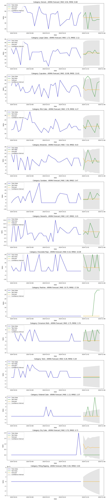
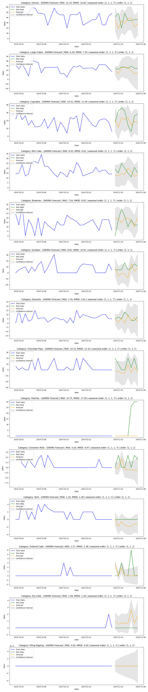
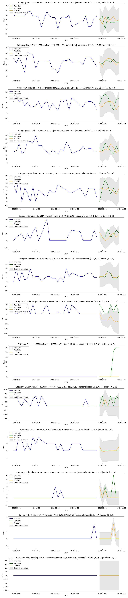

# Sales Predictions for Bakery Item Categories

This project focuses on predicting sales for various bakery item categories using ARIMA, SARIMA, and SARIMA with parameter tuning models. The results demonstrate improved forecasting accuracy across different models for inventory management and seasonal planning.

---

## Project Title
**Sales Predictions for Bakery Item Categories**

---

## Introduction

Accurate sales predictions for bakery items are essential for efficient inventory management, resource allocation, and revenue forecasting. This project leverages time-series forecasting techniques like ARIMA, SARIMA, and SARIMA with parameter tuning to predict weekly, monthly, and seasonal sales. The aim is to achieve prediction accuracy between 80-90%.

---

## Installation Instructions

1. Clone this repository:

   ```bash
   git clone https://github.com/your-repository/sales-predictions.git
   ```

2. Navigate to the project directory:

   ```bash
   cd sales-predictions
   ```

3. Install the required dependencies:

   ```bash
   pip install -r requirements.txt
   ```

---

## Usage Guide

1. Prepare the data by digitizing records from physical files.
2. Preprocess the data (handle missing values, sort data, etc.).
3. Train the models (ARIMA, SARIMA, SARIMA with tuning).
4. Visualize the results to interpret model performance.
5. Launch the Streamlit app for live predictions:

   ```bash
   streamlit run src/app.py
   ```

---

## Results and Visuals

### ARIMA Model Results
The ARIMA model provides baseline predictions for various bakery item categories. Below are the results with corresponding metrics (MAE and RMSE):



### SARIMA Model Results
The SARIMA model incorporates seasonality into the ARIMA model to enhance accuracy. Below are the results with default parameters:



### SARIMA with Parameter Tuning
Using parameter tuning, SARIMA provides improved forecasting accuracy across all categories. Below are the results:



---

## License Information

This project is licensed under the MIT License. You are free to use, modify, and distribute the code and results.

---

